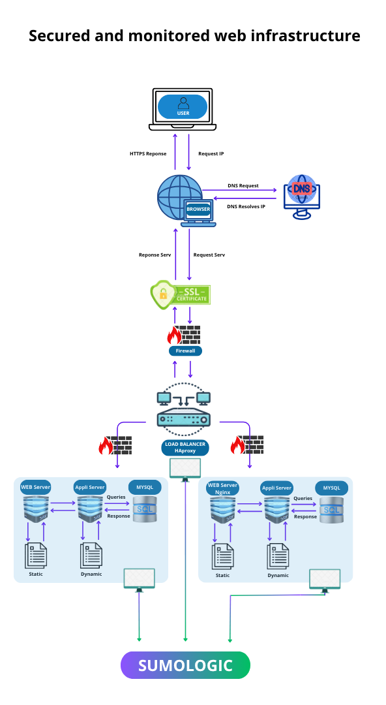

This diagram illustrates the **web request flow** when a user types `https://www.google.com` into their browser and presses **Enter**.

It represents:
- ✅ **DNS Resolution** → The domain name is converted to an IP address via a DNS server.

- ✅ **Server Connection** → The request reaches the server's IP address via the **TCP/IP** protocol.

- ✅ **Security with HTTPS/SSL** → Traffic is **encrypted** to ensure confidentiality.

- ✅ **Firewall Passage** → The request is filtered for security reasons.

- ✅ **Load Balancer Distribution** → Traffic is distributed among several available servers.

- ✅ **Web server processing** → The server **serves the static files** required for the page.

- ✅ **Application server execution** → It **generates the dynamic content**.

- ✅ **Database interaction** → Data is retrieved and displayed on the page.

In summary, it shows the **entire processing cycle** of a web request up to the display of the Google page! 🚀